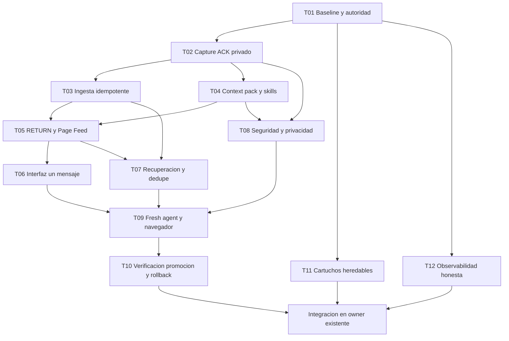

# Plan compartido ejecutable · un mensaje humano y trabajo durable

## Arquitectura de la campaña
**Objetivo humano único:** escribir una vez en Prometeo; entrada y contexto se guardan privadamente con ACK verificable antes de despachar; una ejecución finita y recuperable trabaja con skills/Work Graph; el resultado se devuelve al hilo de la página, sin copiar textos entre chats, sin depender de abrir este historial y sin fingir liveness. Para la UI, módulos heredables/cartuchos conforme EVO-001..EVO-045, sin migración manual en upgrades compatibles.

**Roles de autoridad existentes:** P4 Capture guarda input; Page Change Thread agrupa; Context Foundry selecciona historia; el Work Graph V1.1 y Worker Bus V2 asignan tareas y reincarnan; Guide/Integrator decide integración; Current/Catalog/Lineage/Human Accepted/Served deciden publicación; Shell/Page Host son únicos. Este pack sólo aporta tareas candidatas y comprobaciones, **no es un nuevo scheduler**.

**Skills reutilizadas:** `.agents/skills/prometeo-one-turn/SKILL.md`, `prometeo-web-change/SKILL.md` y `prometeo-verify-release/SKILL.md`. Un actor no puede afirmar que su entorno las cargó hasta leerlas efectivamente. La promoción nunca proviene del autoreporte de productor.

## Grafo de dependencias (no es un cronograma humano)

Los códigos de paquete numerados `T01..T12` están en `03_MANIFEST.json`; cada uno es una **intención de trabajo**, y sólo pasa a tarea operativa cuando el allocator existente emite su Work Packet autorizado. No iniciar en paralelo tareas que muten el mismo owner: el scheduler real debe respetar dependencias y scopes. Fases de lectura/ensayo independientes pueden anticiparse sin tocar fuentes.

## Etapas sin rondas humanas
**F0 · Congelar campaña.** Validar hashes y documentos, índex y 12 TASKs. No lanzar hasta tener autorización de ejecución, owner y mecanismos de dispatch. Si GitHub negó escritura, paquete local congelado; NO afirmar publicado allí.

**F1 · Fuente de verdad y baseline.** Recuperar heads frescos de main/gh-pages, EPOCH, owners, System Constitution, Design DNA, packet actual. Registrar características V15 con assets/visual/responsive/tests. Crear preservation contract y branch/candidate, sin cambiar CURRENT.

**F2 · Input durable.** Resolver de verdad `adapter.createTextCapture`, sincronización P4, ACK remoto y dedupe. Implementar un endpoint/acción idempotente SOLO en el dueño existente para que cada mensaje ingrese en storage privado con revisión comprobada ANTES de ejecutar. Si está offline, persistir local y marcar `LOCAL_ONLY`; no simular remoto.

**F3 · Contexto y lanzamiento sin recap.** Preparar exactamente el contexto de página, intentos, tareas y fracasos necesarios. Resolver cómo la infraestructura autentica un nuevo agente y le entrega packet + skills; no asumir que el ChatGPT app carga automáticamente `.agents/skills`. Work mode puede operar como herramienta distinta, pero no es condición de verdad.

**F4 · Resultado durable.** Resolver E5/E6/E7 RETURN, separación `CANDIDATE/VERIFIED/ACCEPTED/SERVED`, Page Change Thread privado y Feed. Read-after-write para RETURN, marca unread sólo hasta apertura humana, y falla cerrado si no confirma persistencia.

**F5 · Experiencia un mensaje.** Una única acción principal en la página (texto, eventualmente voz): ACK input, dispatch y lectura del resultado. No requiere botón extra Guardar + Trabajar ni enviar prompts de otros chats. La progresión puede verse mientras el humano no interactúa, pero sólo cuando haya actividad real.

**F6 · Recuperación y seguridad.** Reintentos idempotentes, crash antes/después de ACK, soporte de interrupciones de chat y stale-generation rejection mediante bus existente; RLS/private scopes/secret handling, offline, quotas y no polling agresivo.

**F7 · Validación fresca.** Nuevo chat SIN transcript original, recibe sólo packet privado y contexto mínimo. Debe identificar scope e historial y producir cambio material completo con pruebas; 0 copy/paste y 0 segunda orden del humano. E2E mobile/desktop y browser real de bytes servidos.

**F8 · Evolución modular de UI en paralelo controlado.** Compilación manifests/versiones, auto-discovery build-time, capacidades heredables, state separado, read adapters, lifecycle, aislamiento CSS, rollback. Reutilizar capa existente, no crear un segundo shell.

**F9 · Promoción y ratchet.** Verificador independiente y owner promueven sólo si controles y nuevas pruebas PASS, luego confirmar Served. Actualizar Design DNA/invariantes si la regla validada cambió. El usuario recibe respuesta en la página. El siguiente chat arranca desde el mismo estado, no desde una conversación larga.

## Contrato mínimo por TASK
Un Work Packet **emitido por el allocator** (no por estos markdown) contiene `task_id`, source exacto, `base_sha`, `owner`, `write_scope`, `do_not_touch`, `allowed_capabilities`, `human_intent_refs`, `preconditions`, `tests`, `return_path` autorizado y `priority`. Los TASK files de este zip son plantillas/preparación, NO claims. Cada worker ejecuta sin preguntas intermedias todos los pasos software-solvables dentro del alcance, deja candidato+tests+RETURN y luego E8; si falla, checkpoint+boundary probado+residual, sin falsa publicación.

## Congelamiento y desencadenantes
`FREEZE.json` lista SHA256 y conteos; cuando fuente se publique por owner se registra commit de Git y se compila con Work Graph existente. Sólo entonces `PREPARED -> AUTHORIZED -> ARMED` en el mecanismo canónico, nunca editando a mano este pack para inventar `queued=true`. **No iniciar una ráfaga de 12 chats**; las 12 tareas se reparten automáticamente según dependencias/capacidades y backlog, usando workers fungibles con un mismo prompt. Las invocaciones ChatGPT externas requieren una capacidad real de wake, no promesa por texto.

## Métricas de aceptación
- Human turns / feature: objetivo 1; human handoffs: 0.
- Input ACK privado y RETURN read-after-write: 100% en tests, sin falsos positivos.
- Duplicate accepted completions: 0. Lost inputs/outputs: 0 en gauntlet.
- Fresh-chat recovery sin transcript: PASS; stale result rechazado: PASS.
- UI legacy V15: 0 comportamientos perdidos sin aceptación; mobile sin overflow y RIGHT sigue RIGHT.
- Served endpoint: hash/URL/DOM verificables tras promoción. Owner nuevo de autoridad/scheduler: 0.
- Calls por trabajo útil y exit boundaries medidos, no promesa de rendimiento 10x sin benchmark.

## Regla de parada y reanudación
Los chats sí terminan. Su autoridad de tarea puede sobrevivir a través de un contrato durable. Un trabajador sin Work Packet o sin permiso no elige tarea por intuición; devuelve BOUNDARY exacta. Un sistema sin wake automático no dice que lanzó trabajadores; deja los TASKs PREPARED y no obliga al usuario a transportar mensajes por doce chats.
